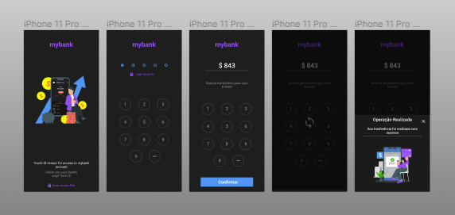

# MybankApp

A simple react native application to simulate bank transfers that uses a PIN component created without lib.

## GetStarted

- 1 - Clone the repository on the local machine

```bash
  git clone https://github.com/jairoevaristo/mybank-app.git
```

- 2 - Access the project folder and install dependencies

```bash
  npm install
```

or

```bash
  yarn install
```

- 3 - Launch the app

```bash
  expo start
```

## Preview app

